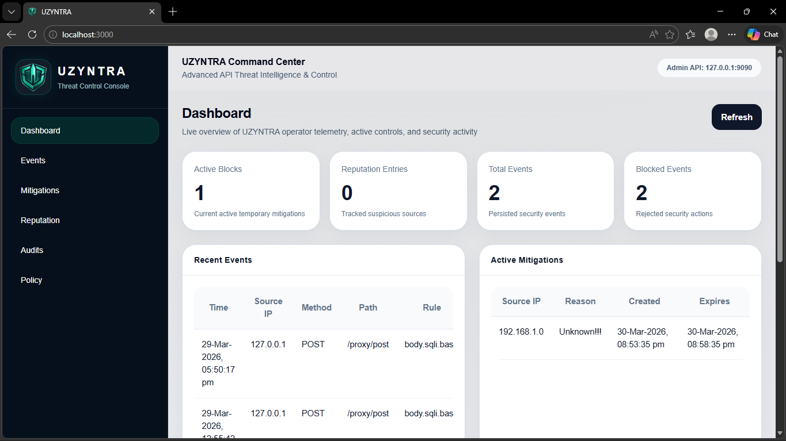
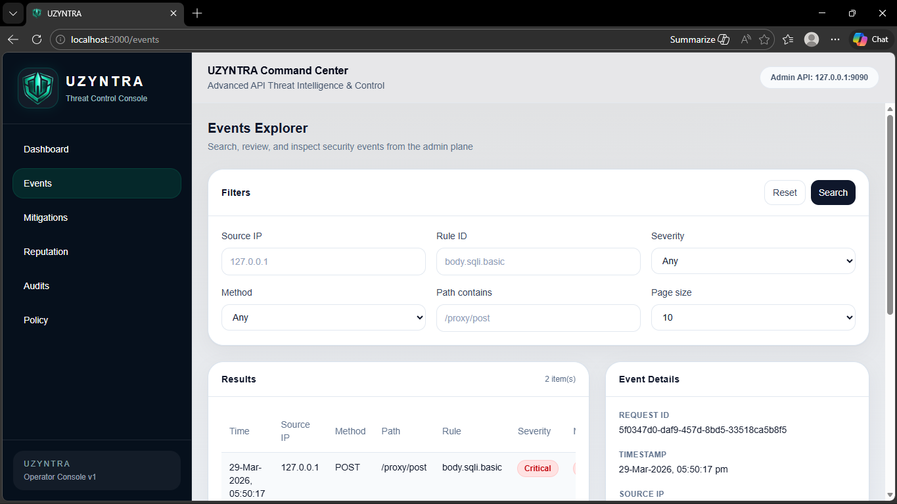
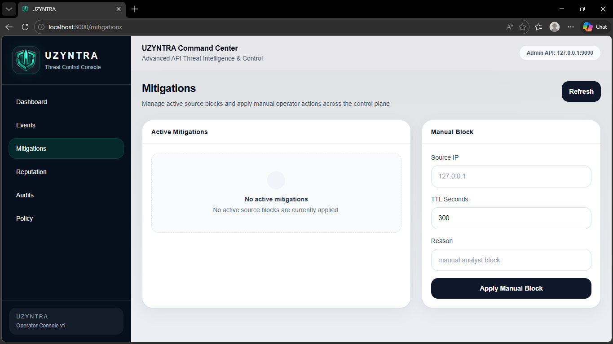
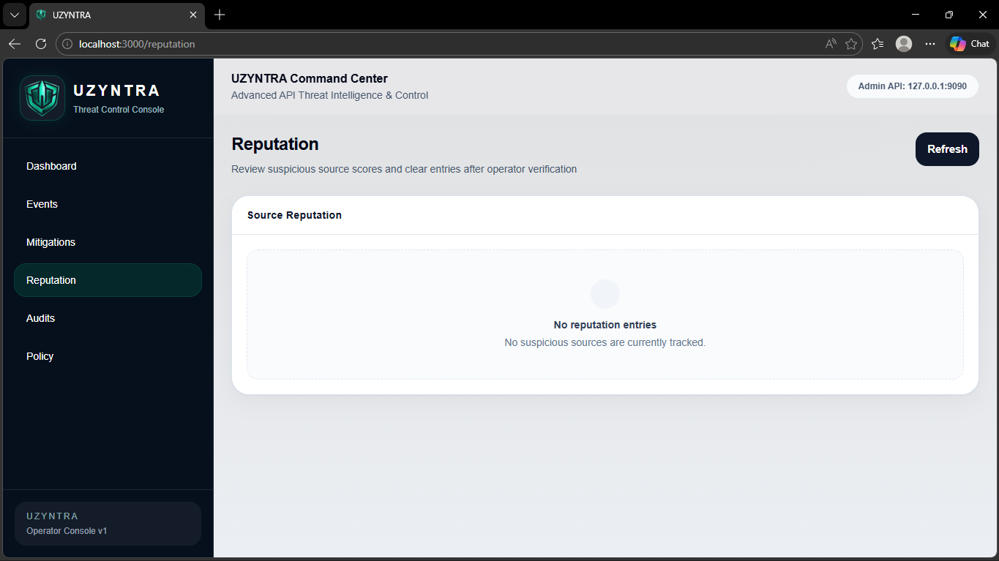
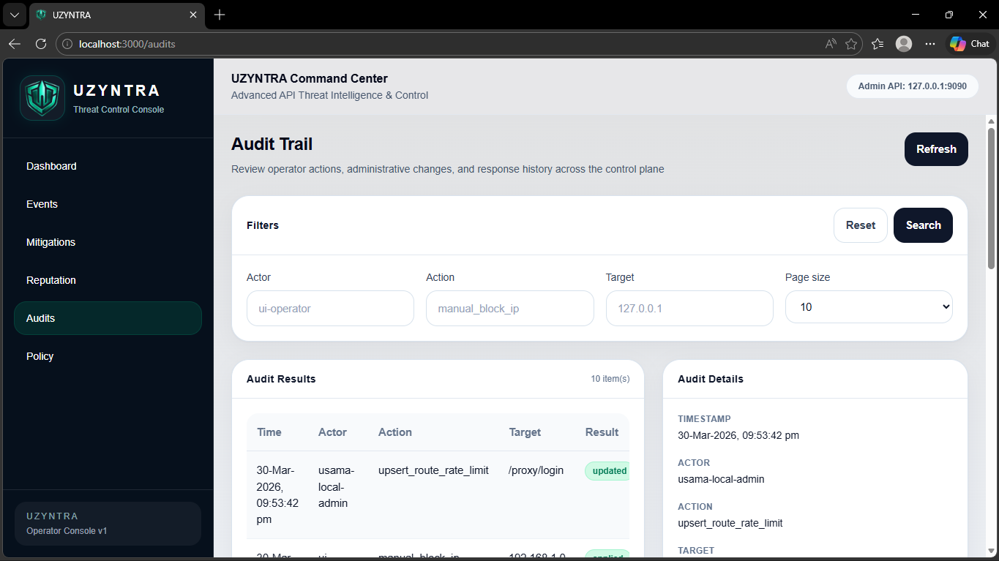
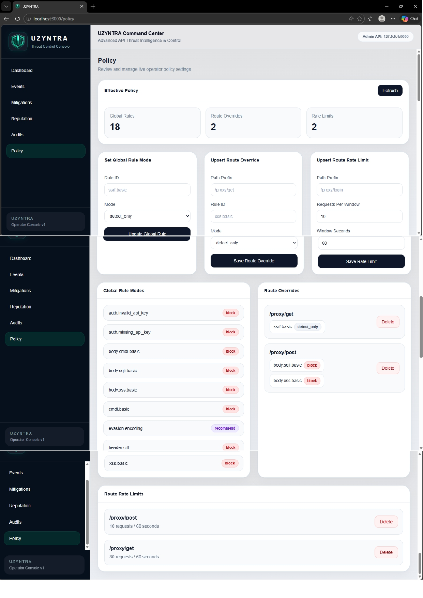

# 🛡️ UZYNTRA UI — Operator Control Console

<p align="center">
  
</p>

<p align="center">
  <b>Advanced API Threat Intelligence & Control Platform UI</b>
</p>

<p align="center">
  <a href="https://github.com/UsamaMatrix/uzyntra-ui">
    
  </a>
  <a href="https://github.com/UsamaMatrix/uzyntra-api-firewall">
    
  </a>
  
  
</p>

---

## 🚀 Overview

**UZYNTRA UI** is a professional operator dashboard built for controlling and monitoring the **UZYNTRA Rust API Firewall**.

It provides a **real-time control plane** for:

- 📊 Monitoring security telemetry
- 🚨 Inspecting attack events
- 🛡️ Managing mitigations
- 🧠 Tracking source reputation
- 📜 Reviewing audit logs
- ⚙️ Controlling security policy

---

## 🚀 Why UZYNTRA?

UZYNTRA is a modern API security platform designed for real-time threat detection, analysis, and response.
Built with performance (Rust), usability (Next.js), and security-first principles, it provides a complete control plane + data plane architecture for protecting APIs at scale.

---

## 🔗 Backend (Required)

This UI connects to the Rust backend:

👉 **UZYNTRA API Firewall (Backend Repo)**  
https://github.com/UsamaMatrix/uzyntra-api-firewall

> ⚠️ The backend **must be running** for the UI to function.

---

## ✨ Features

- 📊 **Dashboard**
  - Metrics overview (events, blocks, reputation)
  - Recent activity monitoring

- 🔍 **Events Explorer**
  - Search & filter security events
  - Inspect findings (SQLi, SSRF, etc.)

- 🛡️ **Mitigation Control**
  - Active block management
  - Manual IP blocking with TTL

- 🧠 **Reputation System**
  - Suspicious source scoring
  - Reset reputation entries

- 📜 **Audit Trail**
  - Full operator activity tracking
  - Action history & accountability

- ⚙️ **Policy Management**
  - Global rule modes
  - Route-based overrides
  - Rate limiting controls

---

## 🎬 UI Preview (GIF)

<p align="center">
  
</p>

---

## 📸 Screenshots

### 🏠 Dashboard


### 🔍 Events Explorer


### 🛡️ Mitigations


### 🧠 Reputation


### 📜 Audit Trail


### ⚙️ Policy Management


---

## 🧰 Tech Stack

- ⚛️ Next.js (App Router)
- 🎨 Tailwind CSS
- 🔗 REST API integration
- ⚡ Optimized operator UI/UX
- 🛡️ Security-first design

---

## 📦 Installation

```bash
git clone https://github.com/UsamaMatrix/uzyntra-ui.git
cd uzyntra-ui
npm install
````

---

## ▶️ Running the App

```bash
npm run dev
```

Open in browser:

```
http://localhost:3000
```

---

## 🔌 Backend Configuration

Make sure backend is running at:

```
http://127.0.0.1:9090
```

Admin token used:

```
dev-admin-token-1
```

You can change this inside:

```
src/lib/api.js
```

---

## 📁 Project Structure

```text
src/
 ├── app/
 │    ├── page.js                # Dashboard
 │    ├── events/page.js
 │    ├── mitigations/page.js
 │    ├── reputation/page.js
 │    ├── audits/page.js
 │    ├── policy/page.js
 │    └── layout.js
 │
 ├── components/
 │    ├── Sidebar.js
 │    ├── Topbar.js
 │    ├── PageHeader.js
 │    ├── MetricCard.js
 │    ├── SectionCard.js
 │    ├── SimpleTable.js
 │    ├── Badge.js
 │    └── EmptyState.js
 │
 └── lib/
      ├── api.js
      └── format.js
```

---

## 🧪 Development Notes

* Sidebar is **fixed layout (non-scrolling)**
* Main panel uses **independent scroll**
* Tables support **horizontal overflow**
* UI is optimized for **operator workflows**

---

## 🧭 Roadmap

* 🔐 Authentication & RBAC
* 📊 Analytics dashboards
* 📈 Charts & threat trends
* 🌐 SaaS multi-tenant support
* 🔔 Alerting & notifications

---

## 🤝 Contribution

Pull requests are welcome.

If you're building on top of UZYNTRA, feel free to fork and extend.

---

## 👨‍💻 Author

**[Muhammad Usama](https://www.linkedin.com/in/usamamatrix/)**
Cyber Security Analyst & Rust Backend Engineer

---

## ⭐ Support

If you like this project:

* ⭐ Star the repo
* 🍴 Fork it
* 🚀 Build something on top of it

---

## 🔗 Related Repository

👉 Backend:
[https://github.com/UsamaMatrix/uzyntra-api-firewall](https://github.com/UsamaMatrix/uzyntra-api-firewall)

---

## 🛡️ UZYNTRA

> *Control. Observe. Defend.*
